# 📊 Scalability Baseline Report

> **Scope:** This report measures the current behavior of the Sundial node under synthetic
> load. Results reflect a single benchmark run executed without remediation and do not
> claim or imply production scalability.

## 📌 Run Metadata

| Field | Value |
| --- | --- |
| Run ID | fee-baseline-100-replay |
| Started At | 2026-06-23T20:09:35.628Z |
| Git SHA | 12a24f9d9068d84a5925e482f42a04a5de84e0f9 |
| Node Endpoint | http://localhost:3000 |
| Prometheus Endpoint | http://localhost:9090 |
| L1 Provider Mode | emulator |
| Wallet Mode | test-wallet |
| Harness Version | 0.1.0 |
| Replay Corpus Path | midgard-manager/packages/scalability-harness/corpora/corpus-v1-net-preview-t-one-to-one-r-na-n-5000000.jsonl |
| Replay Corpus SHA256 | 4c1485e9f69df29001b9c14e8017d0bf0301b377aca02f95cfedd9cb75a3ca80 |
| Host | dev3 (linux/x64, 6 CPUs, 31.0 GB) |

## 🔬 Scenario

| Parameter | Value |
| --- | --- |
| Transaction Type | one-to-one |
| L1 Provider Mode | emulator |
| Wallet Mode | test-wallet |
| Start TPS | 100 |
| Max TPS | 100 |
| Step Multiplier | 2 |
| Tier Duration | 900 s |
| Recovery Duration | 300 s |
| Tx Cost (s) | 0.2 |
| Retry Attempts | 1 |
| Retry Delay | 0 ms |
| Request Events Mode | off |
| Seed | fee-baseline-100-2026-06-23 |
| Replay Corpus Path | midgard-manager/packages/scalability-harness/corpora/corpus-v1-net-preview-t-one-to-one-r-na-n-5000000.jsonl |
| Max Consecutive Probe Failures | 8 |
| Stop On Prometheus Down | true |
| Stop On Commitment Failure | false |
| Stop On Merge Failure | true |
| Max Recovery Queue Size | 5000 |
| Max Recovery Mempool Size | 0 |

## 🏃 Tier Results

| Tier | Target TPS | Result | Enqueued Δ | Mempool Accepted Δ | Committed Tx Δ | Submitted Blocks Δ | Peak Queue | Peak Mempool | Commit Failures Δ | Merge Failures Δ | Collapse Reason |
| --- | --- | --- | --- | --- | --- | --- | --- | --- | --- | --- | --- |
| 0 | 100 | completed ✅ | 93336 | 93682 | 92742 | 91 | 395 | 1224 | 0 | 0 | n/a |

## 🚦 Formal Run Classification

**Classification:** Passed ✅

- Policy checks evaluated: 10
- Violated checks: 0
- Failure-severity violations: 0
- Observation-severity violations: 0

**Reasons:**

- All configured formal run criteria passed.

**Violated checks:**

_No violated checks._

## 💥 Collapse Point

No collapse detected. All tiers completed or ran with incomplete evidence.
**Highest completed tier:** 0 at 100 TPS

## ⚡ Throughput Stage Deltas

The columns below reflect three distinct pipeline stages:

- **Enqueued TPS** (`tx_submissions_enqueued_total`) — rate of transactions
  accepted at the HTTP boundary into the in-memory queue.
  This is not a durability signal; it only reflects HTTP-level acceptance.
- **Mempool Accepted TPS** (`tx_submissions_mempool_accepted_total`) — rate
  of transactions durably written to MempoolDB.
  This is the first durable acceptance boundary and is distinct from the enqueued count.
- **Committed TPS** (`commit_block_tx_count_total`) — rate of transactions
  included in a committed block and rooted in the on-chain state commitment.
- Deprecated alias: `tx_submissions_accepted_total` is legacy and must not
  be used for new reports.

Gaps between adjacent columns identify where the pipeline loses throughput.

| Tier | Target TPS | Enqueued TPS | Mempool Accepted TPS | Committed TPS |
| --- | --- | --- | --- | --- |
| 0 | 100 | 103.70 | 104.09 | 103.04 |

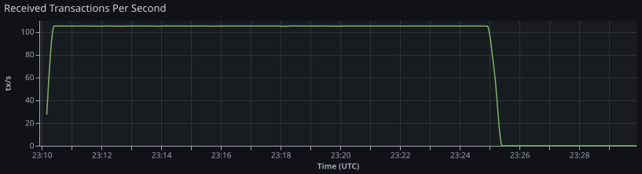

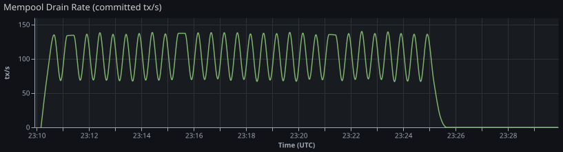

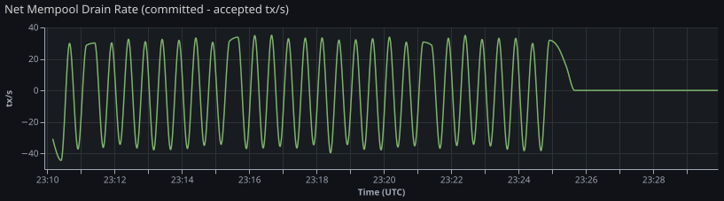

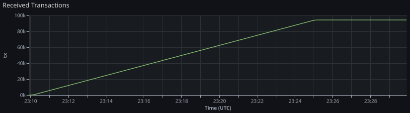

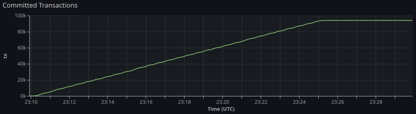

## 📨 Client Submission Evidence

Client-side submission evidence is aggregated per tier/window and does not
require per-request JSONL.

- Outcomes are tracked as submitted, rejected, node_unavailable, and error.
- Retry evidence reports total retries and count of retried submissions.
- Submitted-latency p95 is derived from bounded histogram buckets.

| Tier | Target TPS | Submitted | Rejected | Node Unavailable | Error | Total Retries | Retried Submissions | Submitted Latency p95 (ms) |
| --- | --- | --- | --- | --- | --- | --- | --- | --- |
| 0 | 100 | 94197 | 0 | 0 | 0 | 0 | 0 | 50 |

## ⏱️ Accepted-to-Committed Latency Evidence

Accepted-to-committed latency is estimated from Prometheus counters using
cohort alignment (`cohort_counter_alignment_v1`):

- Bucket accepted transactions by scrape interval from
  `tx_submissions_mempool_accepted_total` deltas.
- For each accepted cohort, find when cumulative committed count
  (`commit_block_tx_count_total`) catches up.
- Compute weighted p50/p95/p99 latency across resolved cohorts.

Confidence notes indicate scrape-resolution limits and unresolved cohorts
(right-censoring at tier window end).

| Tier | Target TPS | Method | Confidence | Resolved Tx Ratio | Accepted→Committed p50 (ms) | Accepted→Committed p95 (ms) | Accepted→Committed p99 (ms) |
| --- | --- | --- | --- | --- | --- | --- | --- |
| 0 | 100 | cohort_counter_alignment_v1 | high | 99.4% | 15000 | 15000 | 15000 |

**Confidence Notes:**

- Tier 0: Scrape step is approximately 15s; latency resolution is bounded by this interval. Only 99.4% of accepted transactions were matched to committed progress before window end.

## 📦 Queue and Mempool Behavior

| Tier | Target TPS | Peak Queue | Final Queue (after recovery) | Peak Mempool | Final Mempool (after recovery) |
| --- | --- | --- | --- | --- | --- |
| 0 | 100 | 395 | 0 | 1224 | 0 |

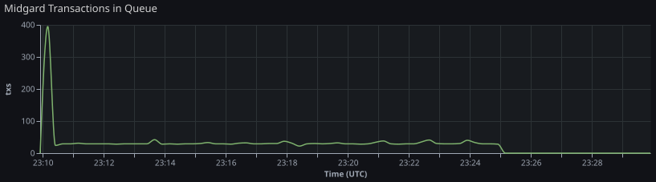

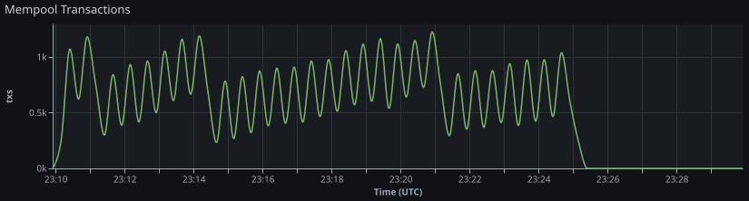

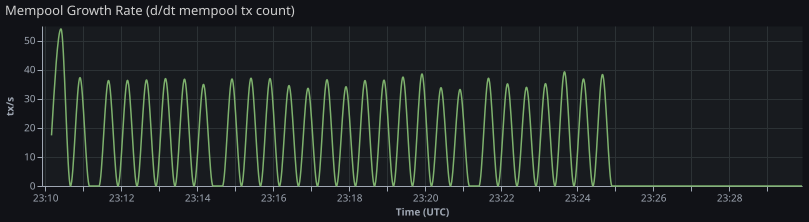

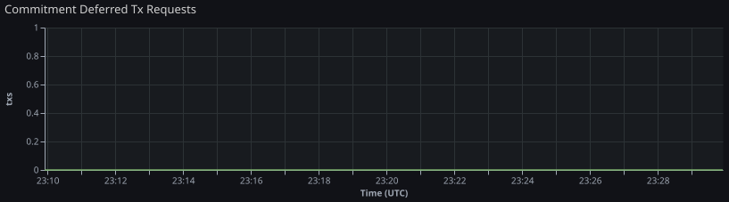

## 🔗 Commit/Submit/Merge Progress

L1 commitment fee fields are derived as follows:
- `L1 Fees Δ` from `l1_commitment_fees_lovelace_total` counter delta over load phase.
- `Last L1 Fee` from `l1_commitment_fee_lovelace_last` at load stop, falling back to the nearest sampled value when the stop-time instant is unavailable.
- `L1 Fee / Committed L2 Tx` = `L1 Fees Δ / Committed Tx Δ` when `Committed Tx Δ > 0`.

| Tier | Target TPS | Committed Blocks Δ | Submitted Blocks Δ | Merged Blocks Δ | Merge Failures Δ | Commit Failures Δ | L1 Fees Δ (lovelace) | Last L1 Fee (lovelace) | L1 Fee / Committed L2 Tx (lovelace) |
| --- | --- | --- | --- | --- | --- | --- | --- | --- | --- |
| 0 | 100 | 91 | 91 | 1 | 0 | 0 | 20853105 | 229155 | 224.85 |

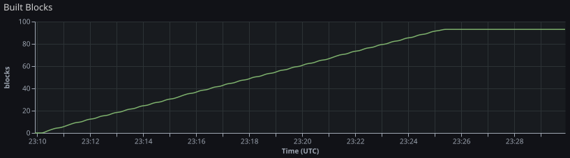

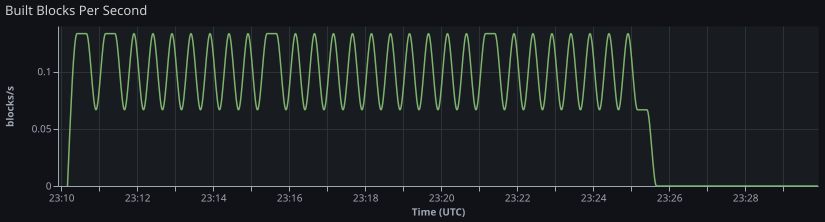

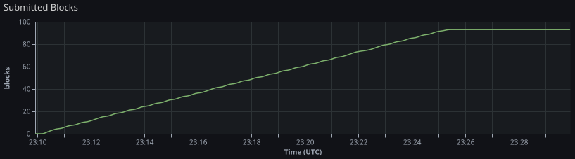

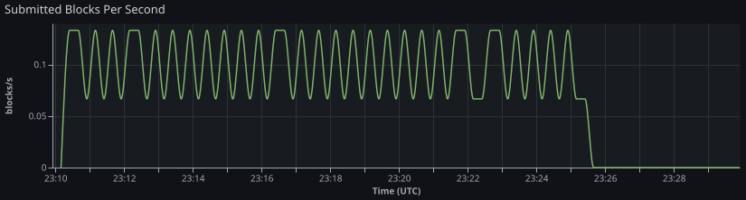

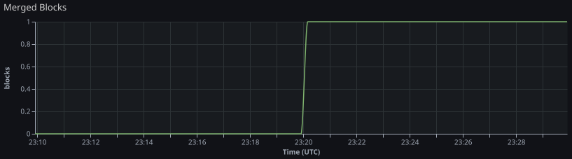

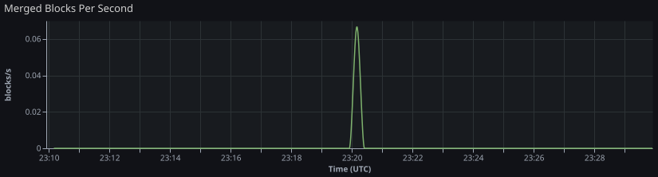

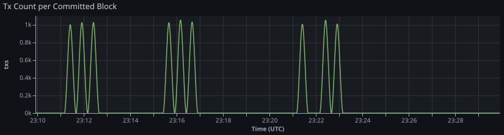

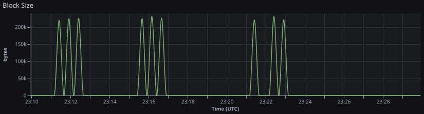

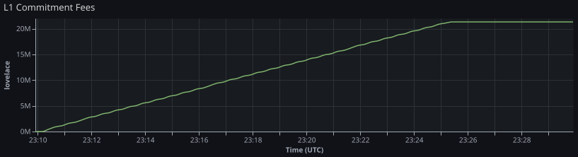

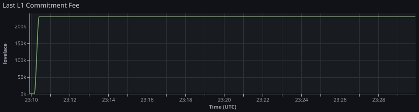

## 🚨 Failure Signals

| Tier | Target TPS | Commit Failures Δ | Merge Failures Δ | Rejected Δ | Queue Backpressure Rejected Δ | Stream Backpressure Rejected Δ | Offer Timeout Rejected Δ | Deferred Tx Requests Peak | Processing Failed Δ |
| --- | --- | --- | --- | --- | --- | --- | --- | --- | --- |
| 0 | 100 | 0 | 0 | 0 | n/a | n/a | n/a | 0 | 0 |

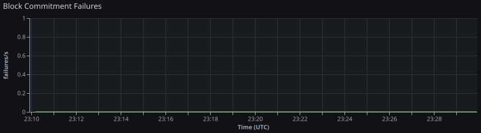

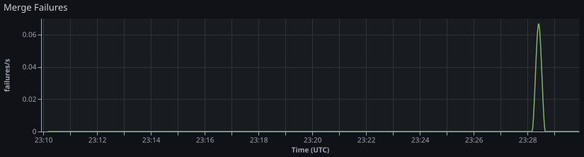

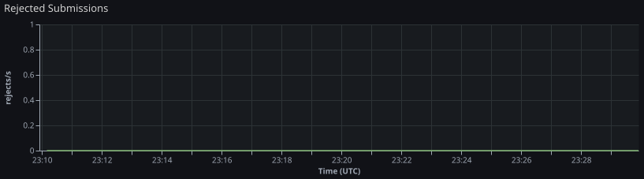

## 🔧 Primary Bottleneck Hypothesis

**Identified bottleneck:** none detected

**Notes:**

- No collapse detected; all tiers completed or ran with incomplete evidence.

## 🖥️ Infrastructure

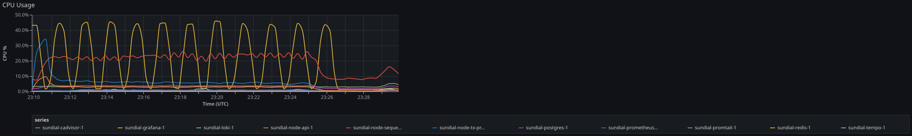

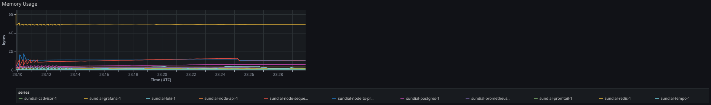

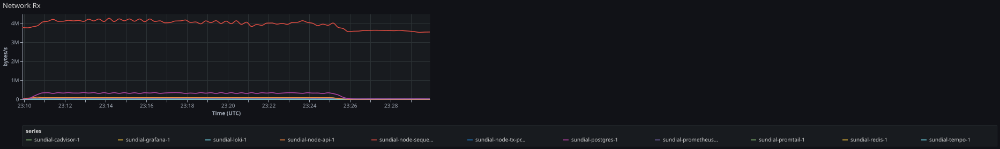

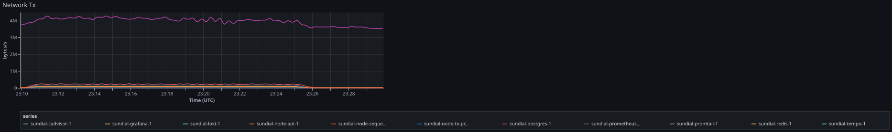

## 📋 Log Evidence (Loki)

Per-tier log capture from Loki over the tier window plus a short post-window tail.
Full log streams are in `loki-captures.json`.

| Tier | Target TPS | Tier Window | Capture Range | Query | Streams | Entries | Truncated | Error |
| --- | --- | --- | --- | --- | --- | --- | --- | --- |
| 0 | 100 | 2026-06-23T20:09:54Z → 2026-06-23T20:29:54Z | 2026-06-23T20:09:54Z → 2026-06-23T20:30:54Z | `{job="containerlogs"}` | 4 | 5000 | true |  |

## 🔍 Trace Evidence (Tempo)

Per-tier trace capture from Tempo over the full tier window (load phase + recovery).
Full trace summaries are in `tempo-captures.json`.

| Tier | Target TPS | Window | Service | Traces | Inspected | Truncated | Error |
| --- | --- | --- | --- | --- | --- | --- | --- |
| 0 | 100 | 2026-06-23T20:09:54Z → 2026-06-23T20:29:54Z | midgard-node | 500 | 3218 | true |  |

## 📂 Artifact Index

- `load-events.jsonl`
- `loki-captures.json`
- `prometheus-samples.json`
- `report.md`
- `run-manifest.json`
- `scenario.json`
- `stdout.log`
- `summary.json`
- `tempo-captures.json`
- `tier-summaries.jsonl`

## ⚠️ Limitations

- This run measures current behavior without remediation.
  No performance tuning, protocol changes, or infrastructure adjustments were applied.
- Results reflect a single run under the configured synthetic load profile.
  They may not reproduce identically under different hardware, network, or node state.
- This report does not claim or imply production scalability.
  Observed TPS figures are specific to the test configuration and should not be extrapolated.
- Enqueued TPS, mempool accepted TPS, and committed TPS are distinct pipeline boundaries.
  Conflating them overstates actual throughput.
- The legacy alias `tx_submissions_accepted_total` is intentionally excluded
  from this report to keep enqueue and durable-acceptance boundaries explicit.
- Bottleneck attribution is derived from counter deltas over the tier window.
  Scrape jitter, slow counters, or incomplete Prometheus data may reduce accuracy.
- Accepted-to-committed latency is a cohort estimate from counter alignment,
  not per-transaction tracing. It is bounded by Prometheus scrape cadence and window coverage.
