# 📊 Scalability Baseline Report

> **Scope:** This report measures the current behavior of the Sundial node under synthetic
> load. Results reflect a single benchmark run executed without remediation and do not
> claim or imply production scalability.

## 📌 Run Metadata

| Field                    | Value                                                                                                                                  |
| ------------------------ | -------------------------------------------------------------------------------------------------------------------------------------- |
| Run ID                   | baseline-100-800-replay                                                                                                                |
| Started At               | 2026-05-27T11:15:21.633Z                                                                                                               |
| Git SHA                  | 30eb12b19e9b3e4a3dbf90ee93309d3a5aed7a3c                                                                                               |
| Node Endpoint            | http://localhost:3000                                                                                                                  |
| Prometheus Endpoint      | http://localhost:9090                                                                                                                  |
| L1 Provider Mode         | emulator                                                                                                                               |
| Wallet Mode              | test-wallet                                                                                                                            |
| Wallet Provisioning Note | external-key mode — set WALLET_PRIVATE_KEY to a pre-funded key whose UTxOs are initialized on the node before running replay scenarios |
| Harness Version          | 0.1.0                                                                                                                                  |
| Replay Corpus Path       | midgard-manager/packages/scalability-harness/corpora/corpus-v1-net-preview-t-one-to-one-r-na-n-5000000.jsonl                     |
| Replay Corpus SHA256     | 4c1485e9f69df29001b9c14e8017d0bf0301b377aca02f95cfedd9cb75a3ca80                                                                       |
| Host                     | dev3 (linux/x64, 6 CPUs, 31.0 GB)                                                                                                      |

## 🔬 Scenario

| Parameter                      | Value                                                                                                                                  |
| ------------------------------ | -------------------------------------------------------------------------------------------------------------------------------------- |
| Transaction Type               | one-to-one                                                                                                                             |
| L1 Provider Mode               | emulator                                                                                                                               |
| Wallet Mode                    | test-wallet                                                                                                                            |
| Wallet Provisioning Note       | external-key mode — set WALLET_PRIVATE_KEY to a pre-funded key whose UTxOs are initialized on the node before running replay scenarios |
| Start TPS                      | 100                                                                                                                                    |
| Max TPS                        | 800                                                                                                                                    |
| Step Multiplier                | 2                                                                                                                                      |
| Tier Duration                  | 180 s                                                                                                                                  |
| Recovery Duration              | 90 s                                                                                                                                   |
| Tx Cost (s)                    | 0.2                                                                                                                                    |
| Retry Attempts                 | 1                                                                                                                                      |
| Retry Delay                    | 0 ms                                                                                                                                   |
| Request Events Mode            | off                                                                                                                                    |
| Seed                           | baseline-2026-05-18                                                                                                                    |
| Replay Corpus Path             | midgard-manager/packages/scalability-harness/corpora/corpus-v1-net-preview-t-one-to-one-r-na-n-5000000.jsonl                     |
| Max Consecutive Probe Failures | 8                                                                                                                                      |
| Stop On Prometheus Down        | false                                                                                                                                  |
| Stop On Commitment Failure     | true                                                                                                                                   |
| Stop On Merge Failure          | false                                                                                                                                  |
| Max Recovery Queue Size        | 10000                                                                                                                                  |
| Max Recovery Mempool Size      | 5000                                                                                                                                   |

## 🏃 Tier Results

| Tier | Target TPS | Result       | Enqueued Δ | Mempool Accepted Δ | Committed Tx Δ | Submitted Blocks Δ | Peak Queue | Peak Mempool | Commit Failures Δ | Merge Failures Δ | Collapse Reason |
| ---- | ---------- | ------------ | ---------- | ------------------ | -------------- | ------------------ | ---------- | ------------ | ----------------- | ---------------- | --------------- |
| 0    | 100        | completed ✅ | 18517      | 18510              | 0              | 0                  | 32         | 18747        | 0                 | 0                | n/a             |
| 1    | 200        | completed ✅ | 37006      | 36988              | 35546          | 25                 | 67         | 2255         | 0                 | 0                | n/a             |
| 2    | 400        | completed ✅ | 73929      | 73897              | 67499          | 19                 | 130        | 6886         | 0                 | 1                | n/a             |
| 3    | 800        | completed ✅ | 147705     | 146323             | 93893          | 7                  | 1962       | 51600        | 0                 | 1                | n/a             |

## 🚦 Formal Run Classification

**Classification:** Passed ✅

- Policy checks evaluated: 10
- Violated checks: 0
- Failure-severity violations: 0
- Observation-severity violations: 0

**Reasons:**

- All configured formal run criteria passed.

**Violated checks:**

_No violated checks._

## 💥 Collapse Point

No collapse detected. All tiers completed or ran with incomplete evidence.
**Highest completed tier:** 3 at 800 TPS

## ⚡ Throughput Stage Deltas

The columns below reflect three distinct pipeline stages:

- **Enqueued TPS** (`tx_submissions_enqueued_total`) — rate of transactions
  accepted at the HTTP boundary into the in-memory queue.
  This is not a durability signal; it only reflects HTTP-level acceptance.
- **Mempool Accepted TPS** (`tx_submissions_mempool_accepted_total`) — rate
  of transactions durably written to MempoolDB.
  This is the first durable acceptance boundary and is distinct from the enqueued count.
- **Committed TPS** (`commit_block_tx_count_total`) — rate of transactions
  included in a committed block and rooted in the on-chain state commitment.
- Deprecated alias: `tx_submissions_accepted_total` is legacy and must not
  be used for new reports.

Gaps between adjacent columns identify where the pipeline loses throughput.

| Tier | Target TPS | Enqueued TPS | Mempool Accepted TPS | Committed TPS |
| ---- | ---------- | ------------ | -------------------- | ------------- |
| 0    | 100        | 102.85       | 102.81               | 0.00          |
| 1    | 200        | 205.58       | 205.48               | 197.47        |
| 2    | 400        | 410.70       | 410.52               | 374.98        |
| 3    | 800        | 820.55       | 812.87               | 521.60        |

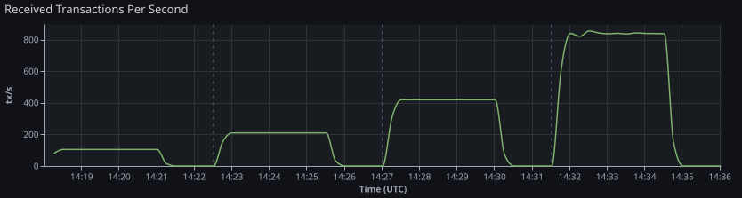

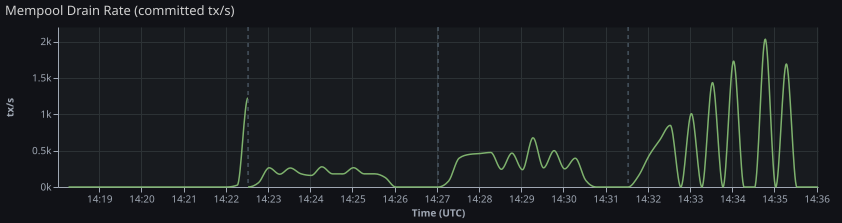

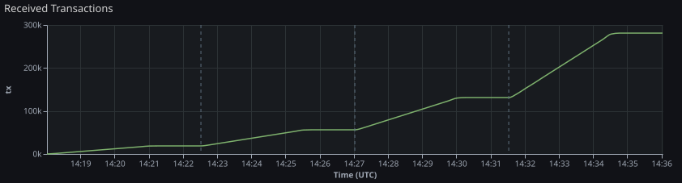

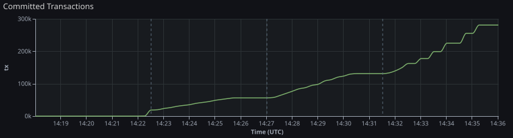

## 📨 Client Submission Evidence

Client-side submission evidence is aggregated per tier/window and does not
require per-request JSONL.

- Outcomes are tracked as submitted, rejected, node_unavailable, and error.
- Retry evidence reports total retries and count of retried submissions.
- Submitted-latency p95 is derived from bounded histogram buckets.

| Tier | Target TPS | Submitted | Rejected | Node Unavailable | Error | Total Retries | Retried Submissions | Submitted Latency p95 (ms) |
| ---- | ---------- | --------- | -------- | ---------------- | ----- | ------------- | ------------------- | -------------------------- |
| 0    | 100        | 18696     | 0        | 0                | 0     | 0             | 0                   | 50                         |
| 1    | 200        | 37415     | 0        | 0                | 0     | 0             | 0                   | 50                         |
| 2    | 400        | 74927     | 0        | 0                | 0     | 0             | 0                   | 50                         |
| 3    | 800        | 148993    | 0        | 0                | 0     | 0             | 0                   | 1000                       |

## ⏱️ Accepted-to-Committed Latency Evidence

Accepted-to-committed latency is estimated from Prometheus counters using
cohort alignment (`cohort_counter_alignment_v1`):

- Bucket accepted transactions by scrape interval from
  `tx_submissions_mempool_accepted_total` deltas.
- For each accepted cohort, find when cumulative committed count
  (`commit_block_tx_count_total`) catches up.
- Compute weighted p50/p95/p99 latency across resolved cohorts.

Confidence notes indicate scrape-resolution limits and unresolved cohorts
(right-censoring at tier window end).

| Tier | Target TPS | Method                      | Confidence | Resolved Tx Ratio | Accepted→Committed p50 (ms) | Accepted→Committed p95 (ms) | Accepted→Committed p99 (ms) |
| ---- | ---------- | --------------------------- | ---------- | ----------------- | --------------------------- | --------------------------- | --------------------------- |
| 0    | 100        | cohort_counter_alignment_v1 | high       | 100.0%            | 165000                      | 255000                      | 255000                      |
| 1    | 200        | cohort_counter_alignment_v1 | high       | 100.0%            | 15000                       | 15000                       | 15000                       |
| 2    | 400        | cohort_counter_alignment_v1 | high       | 98.5%             | 15000                       | 30000                       | 30000                       |
| 3    | 800        | cohort_counter_alignment_v1 | high       | 97.6%             | 45000                       | 75000                       | 75000                       |

**Confidence Notes:**

- Tier 0: Scrape step is approximately 15s; latency resolution is bounded by this interval. All accepted cohorts observed in this tier were matched to committed progress.
- Tier 1: Scrape step is approximately 15s; latency resolution is bounded by this interval. All accepted cohorts observed in this tier were matched to committed progress.
- Tier 2: Scrape step is approximately 15s; latency resolution is bounded by this interval. Only 98.5% of accepted transactions were matched to committed progress before window end.
- Tier 3: Scrape step is approximately 15s; latency resolution is bounded by this interval. Only 97.6% of accepted transactions were matched to committed progress before window end.

## 📦 Queue and Mempool Behavior

| Tier | Target TPS | Peak Queue | Final Queue (after recovery) | Peak Mempool | Final Mempool (after recovery) |
| ---- | ---------- | ---------- | ---------------------------- | ------------ | ------------------------------ |
| 0    | 100        | 32         | 0                            | 18747        | 0                              |
| 1    | 200        | 67         | 0                            | 2255         | 0                              |
| 2    | 400        | 130        | 0                            | 6886         | 0                              |
| 3    | 800        | 1962       | 0                            | 51600        | 0                              |

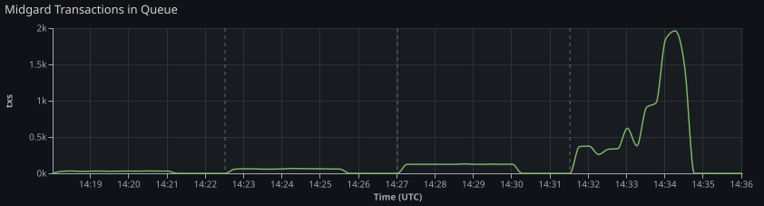

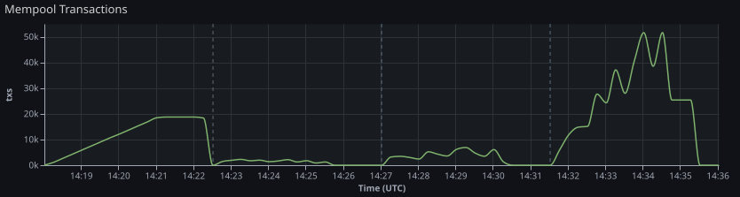

## 🔗 Commit/Submit/Merge Progress

L1 commitment fee fields are derived as follows:

- `L1 Fees Δ` from `l1_commitment_fees_lovelace_total` counter delta over load phase.
- `Last L1 Fee` from `l1_commitment_fee_lovelace_last` instant value at load stop.
- `L1 Fee / Committed L2 Tx` = `L1 Fees Δ / Committed Tx Δ` when `Committed Tx Δ > 0`.

| Tier | Target TPS | Committed Blocks Δ | Submitted Blocks Δ | Merged Blocks Δ | Merge Failures Δ | Commit Failures Δ | L1 Fees Δ (lovelace) | Last L1 Fee (lovelace) | L1 Fee / Committed L2 Tx (lovelace) |
| ---- | ---------- | ------------------ | ------------------ | --------------- | ---------------- | ----------------- | -------------------- | ---------------------- | ----------------------------------- |
| 0    | 100        | 0                  | 0                  | 0               | 0                | 0                 | 0                    | 0                      | n/a                                 |
| 1    | 200        | 25                 | 25                 | 0               | 0                | 0                 | 5610075              | 224403                 | 157.83                              |
| 2    | 400        | 19                 | 19                 | 0               | 1                | 0                 | 4263657              | 224403                 | 63.17                               |
| 3    | 800        | 7                  | 7                  | 0               | 1                | 0                 | 1570821              | 224403                 | 16.73                               |

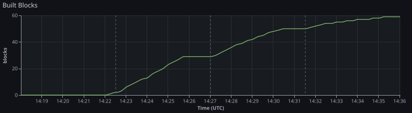

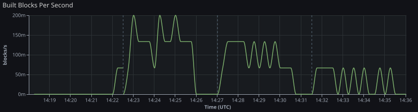

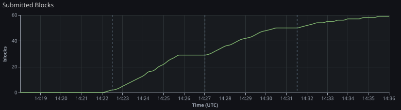

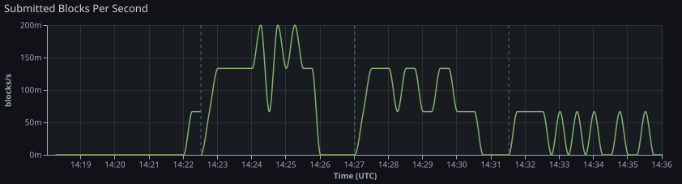

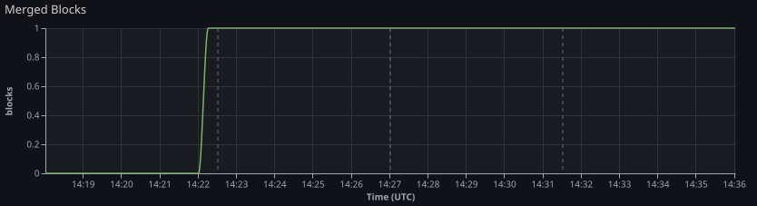

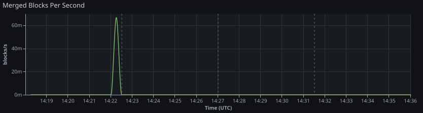

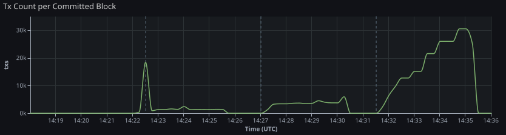

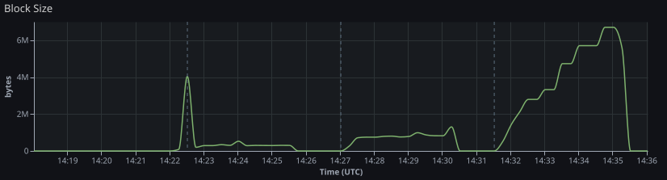

## 🚨 Failure Signals

| Tier | Target TPS | Commit Failures Δ | Merge Failures Δ | Rejected Δ | Processing Failed Δ |
| ---- | ---------- | ----------------- | ---------------- | ---------- | ------------------- |
| 0    | 100        | 0                 | 0                | 0          | 0                   |
| 1    | 200        | 0                 | 0                | 0          | 0                   |
| 2    | 400        | 0                 | 1                | 0          | 0                   |
| 3    | 800        | 0                 | 1                | 0          | 0                   |

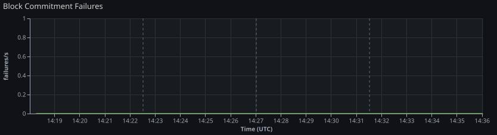

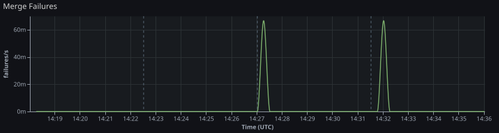

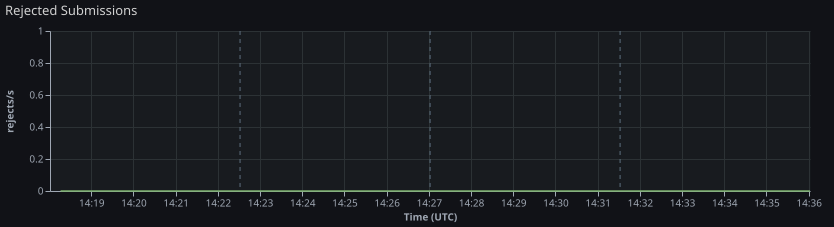

## 🔧 Primary Bottleneck Hypothesis

**Identified bottleneck:** none detected

**Notes:**

- No collapse detected; all tiers completed or ran with incomplete evidence.

## 🖥️ Infrastructure

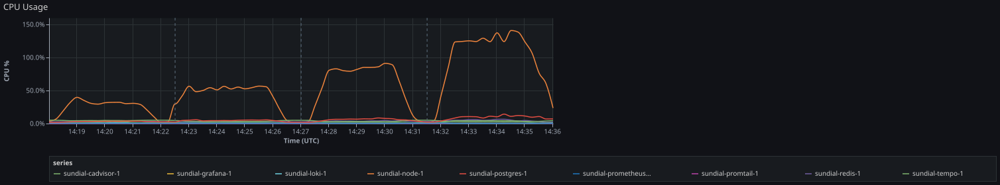

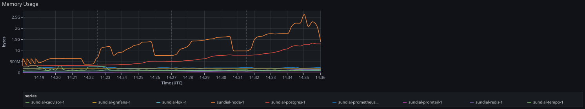

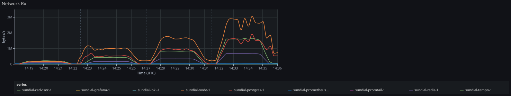

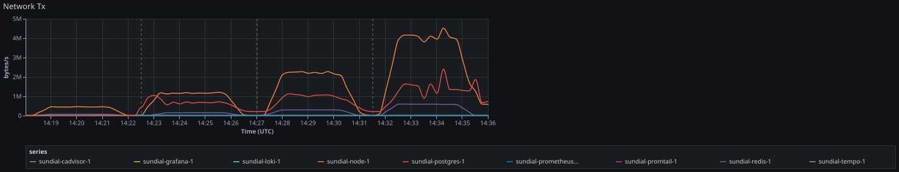

## 📋 Log Evidence (Loki)

Per-tier log capture from Loki over the tier window plus a short post-window tail.
Full log streams are in `loki-captures.json`.

| Tier | Target TPS | Tier Window                                 | Capture Range                               | Query                   | Streams | Entries | Truncated | Error |
| ---- | ---------- | ------------------------------------------- | ------------------------------------------- | ----------------------- | ------- | ------- | --------- | ----- |
| 0    | 100        | 2026-05-27T11:18:01Z → 2026-05-27T11:22:31Z | 2026-05-27T11:18:01Z → 2026-05-27T11:23:31Z | `{job="containerlogs"}` | 2       | 744     | false     |       |
| 1    | 200        | 2026-05-27T11:22:31Z → 2026-05-27T11:27:01Z | 2026-05-27T11:22:31Z → 2026-05-27T11:28:01Z | `{job="containerlogs"}` | 2       | 1245    | false     |       |
| 2    | 400        | 2026-05-27T11:27:01Z → 2026-05-27T11:31:31Z | 2026-05-27T11:27:01Z → 2026-05-27T11:32:31Z | `{job="containerlogs"}` | 2       | 1684    | false     |       |
| 3    | 800        | 2026-05-27T11:31:31Z → 2026-05-27T11:36:01Z | 2026-05-27T11:31:31Z → 2026-05-27T11:37:01Z | `{job="containerlogs"}` | 2       | 2016    | false     |       |

## 🔍 Trace Evidence (Tempo)

Per-tier trace capture from Tempo over the full tier window (load phase + recovery).
Full trace summaries are in `tempo-captures.json`.

| Tier | Target TPS | Window                                      | Service      | Traces | Inspected | Truncated | Error |
| ---- | ---------- | ------------------------------------------- | ------------ | ------ | --------- | --------- | ----- |
| 0    | 100        | 2026-05-27T11:18:01Z → 2026-05-27T11:22:31Z | midgard-node | 1      | 1         | false     |       |
| 1    | 200        | 2026-05-27T11:22:31Z → 2026-05-27T11:27:01Z | midgard-node | 0      | n/a       | false     |       |
| 2    | 400        | 2026-05-27T11:27:01Z → 2026-05-27T11:31:31Z | midgard-node | 0      | n/a       | false     |       |
| 3    | 800        | 2026-05-27T11:31:31Z → 2026-05-27T11:36:01Z | midgard-node | 0      | n/a       | false     |       |

## 📂 Artifact Index

- `load-events.jsonl`
- `loki-captures.json`
- `prometheus-samples.json`
- `report.md`
- `run-manifest.json`
- `scenario.json`
- `stdout.log`
- `summary.json`
- `tempo-captures.json`
- `tier-summaries.jsonl`

## ⚠️ Limitations

- This run measures current behavior without remediation.
  No performance tuning, protocol changes, or infrastructure adjustments were applied.
- Results reflect a single run under the configured synthetic load profile.
  They may not reproduce identically under different hardware, network, or node state.
- This report does not claim or imply production scalability.
  Observed TPS figures are specific to the test configuration and should not be extrapolated.
- Enqueued TPS, mempool accepted TPS, and committed TPS are distinct pipeline boundaries.
  Conflating them overstates actual throughput.
- The legacy alias `tx_submissions_accepted_total` is intentionally excluded
  from this report to keep enqueue and durable-acceptance boundaries explicit.
- Bottleneck attribution is derived from counter deltas over the tier window.
  Scrape jitter, slow counters, or incomplete Prometheus data may reduce accuracy.
- Accepted-to-committed latency is a cohort estimate from counter alignment,
  not per-transaction tracing. It is bounded by Prometheus scrape cadence and window coverage.
