# Scalability Baseline Report

> **Scope:** This report measures the current behavior of the Midgard node under synthetic
> load. Results reflect a single benchmark run executed without remediation and do not
> claim or imply production scalability.

## Run Metadata

| Field                    | Value                                                                                                              |
| ------------------------ | ------------------------------------------------------------------------------------------------------------------ |
| Run ID                   | initial-800-replay                                                                                                 |
| Started At               | 2026-05-21T13:16:18.076Z                                                                                           |
| Git SHA                  | e0b938c463b081b4cb7e3a7ab2a0634dc8efe689                                                                           |
| Node Endpoint            | http://localhost:3000                                                                                              |
| Prometheus Endpoint      | http://localhost:9090                                                                                              |
| L1 Provider Mode         | emulator                                                                                                           |
| Wallet Mode              | test-wallet                                                                                                        |
| Wallet Provisioning Note | test-wallet mode — node must be initialised with L2 genesis UTxOs for the generated test key                       |
| Harness Version          | 0.1.0                                                                                                              |
| Replay Corpus Path       | /demo/midgard-manager/packages/scalability-harness/corpora/corpus-v1-net-preview-t-one-to-one-r-na-n-5000000.jsonl |
| Replay Corpus SHA256     | 4c1485e9f69df29001b9c14e8017d0bf0301b377aca02f95cfedd9cb75a3ca80                                                   |
| Host                     | dev3 (linux/x64, 6 CPUs, 31.0 GB)                                                                                  |

## Scenario

| Parameter                      | Value                                                                                                              |
| ------------------------------ | ------------------------------------------------------------------------------------------------------------------ |
| Transaction Type               | one-to-one                                                                                                         |
| L1 Provider Mode               | emulator                                                                                                           |
| Wallet Mode                    | test-wallet                                                                                                        |
| Wallet Provisioning Note       | test-wallet mode — node must be initialised with L2 genesis UTxOs for the generated test key                       |
| Start TPS                      | 800                                                                                                                |
| Max TPS                        | 800                                                                                                                |
| Step Multiplier                | 2                                                                                                                  |
| Tier Duration                  | 1800 s                                                                                                             |
| Recovery Duration              | 300 s                                                                                                              |
| Tx Cost (s)                    | 0.2                                                                                                                |
| Retry Attempts                 | 3                                                                                                                  |
| Retry Delay                    | 500 ms                                                                                                             |
| Request Events Mode            | off                                                                                                                |
| Seed                           | initial-800-2026-05-20                                                                                             |
| Replay Corpus Path             | /demo/midgard-manager/packages/scalability-harness/corpora/corpus-v1-net-preview-t-one-to-one-r-na-n-5000000.jsonl |
| Max Consecutive Probe Failures | 5                                                                                                                  |
| Stop On Prometheus Down        | false                                                                                                              |
| Stop On Commitment Failure     | true                                                                                                               |
| Stop On Merge Failure          | false                                                                                                              |
| Max Recovery Queue Size        | 25000                                                                                                              |
| Max Recovery Mempool Size      | 15000                                                                                                              |

## Tier Results

| Tier | Target TPS | Result    | Enqueued Δ | Mempool Accepted Δ | Committed Tx Δ | Submitted Blocks Δ | Peak Queue | Peak Mempool | Commit Failures Δ | Merge Failures Δ | Collapse Reason       |
| ---- | ---------- | --------- | ---------- | ------------------ | -------------- | ------------------ | ---------- | ------------ | ----------------- | ---------------- | --------------------- |
| 0    | 800        | collapsed | 1867040    | 1858055            | 787733         | 11                 | 2443       | 1664382      | 2                 | 0                | mempool_not_recovered |

## Formal Run Classification

**Classification:** Failed

- Policy checks evaluated: 10
- Violated checks: 3
- Failure-severity violations: 3
- Observation-severity violations: 0

**Reasons:**

- Collapsed tiers are within threshold: 1 (expected <= 0)
- Minimum completed tiers reached: 0 (expected >= 1)
- Final mempool growth after recovery: 1664382 (expected <= 15000)

**Violated checks:**

| Check                                | Severity | Expected | Observed | Details                                                                          |
| ------------------------------------ | -------- | -------- | -------- | -------------------------------------------------------------------------------- |
| Collapsed tiers are within threshold | failure  | <= 0     | 1        | Collapsed tier count exceeds threshold by 1.                                     |
| Minimum completed tiers reached      | failure  | >= 1     | 0        | Completed tier count is below required minimum by 1.                             |
| Final mempool growth after recovery  | failure  | <= 15000 | 1664382  | Observed as the maximum (afterRecovery - before) mempool delta across all tiers. |

## Collapse Point

**First collapsed tier:** 0 at 800 TPS
**Highest completed tier:** none

## Throughput Stage Deltas

The columns below reflect three distinct pipeline stages:

- **Enqueued TPS** (`tx_submissions_enqueued_total`) — rate of transactions
  accepted at the HTTP boundary into the in-memory queue.
  This is not a durability signal; it only reflects HTTP-level acceptance.
- **Mempool Accepted TPS** (`tx_submissions_mempool_accepted_total`) — rate
  of transactions durably written to MempoolDB.
  This is the first durable acceptance boundary and is distinct from the enqueued count.
- **Committed TPS** (`commit_block_tx_count_total`) — rate of transactions
  included in a committed block and rooted in the on-chain state commitment.
- Deprecated alias: `tx_submissions_accepted_total` is legacy and must not
  be used for new reports.

Gaps between adjacent columns identify where the pipeline loses throughput.

| Tier | Target TPS | Enqueued TPS | Mempool Accepted TPS | Committed TPS |
| ---- | ---------- | ------------ | -------------------- | ------------- |
| 0    | 800        | 1037.16      | 1032.17              | 437.60        |

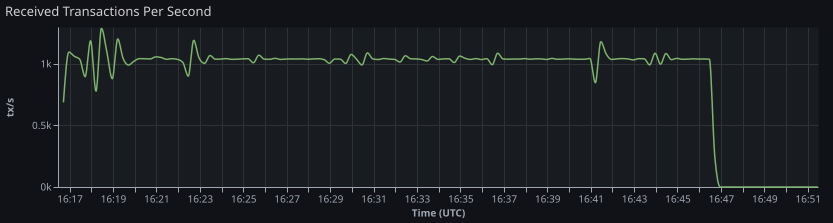

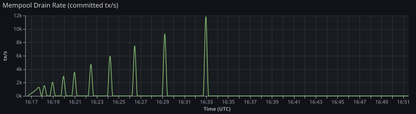

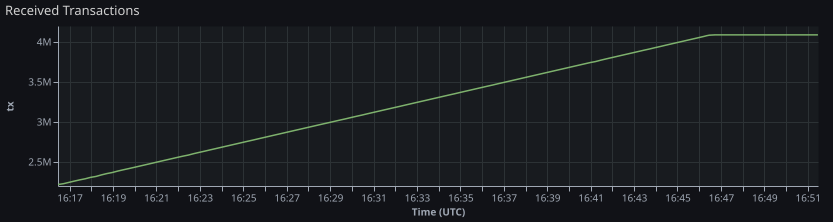

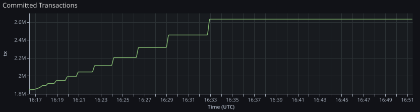

## Client Submission Evidence

Client-side submission evidence is aggregated per tier/window and does not
require per-request JSONL.

- Outcomes are tracked as submitted, rejected, node_unavailable, and error.
- Retry evidence reports total retries and count of retried submissions.
- Submitted-latency p95 is derived from bounded histogram buckets.

| Tier | Target TPS | Submitted | Rejected | Node Unavailable | Error | Total Retries | Retried Submissions | Submitted Latency p95 (ms) |
| ---- | ---------- | --------- | -------- | ---------------- | ----- | ------------- | ------------------- | -------------------------- |
| 0    | 800        | 1862381   | 0        | 0                | 0     | 8873          | 8552                | 2000                       |

## Accepted-to-Committed Latency Evidence

Accepted-to-committed latency is estimated from Prometheus counters using
cohort alignment (`cohort_counter_alignment_v1`):

- Bucket accepted transactions by scrape interval from
  `tx_submissions_mempool_accepted_total` deltas.
- For each accepted cohort, find when cumulative committed count
  (`commit_block_tx_count_total`) catches up.
- Compute weighted p50/p95/p99 latency across resolved cohorts.

Confidence notes indicate scrape-resolution limits and unresolved cohorts
(right-censoring at tier window end).

| Tier | Target TPS | Method                      | Confidence | Resolved Tx Ratio | Accepted→Committed p50 (ms) | Accepted→Committed p95 (ms) | Accepted→Committed p99 (ms) |
| ---- | ---------- | --------------------------- | ---------- | ----------------- | --------------------------- | --------------------------- | --------------------------- |
| 0    | 800        | cohort_counter_alignment_v1 | low        | 41.3%             | 180000                      | 360000                      | 390000                      |

**Confidence Notes:**

- Tier 0: Scrape step is approximately 15s; latency resolution is bounded by this interval. Only 41.3% of accepted transactions were matched to committed progress before window end.

## Queue and Mempool Behavior

| Tier | Target TPS | Peak Queue | Final Queue (after recovery) | Peak Mempool | Final Mempool (after recovery) |
| ---- | ---------- | ---------- | ---------------------------- | ------------ | ------------------------------ |
| 0    | 800        | 2443       | 0                            | 1664382      | 1664382                        |

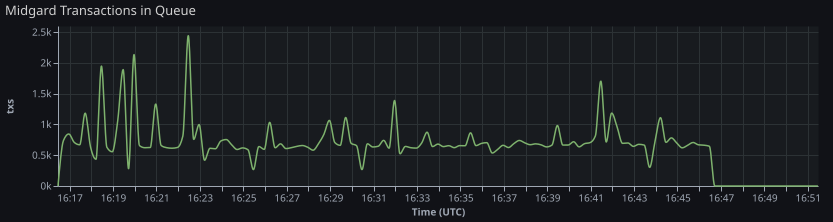

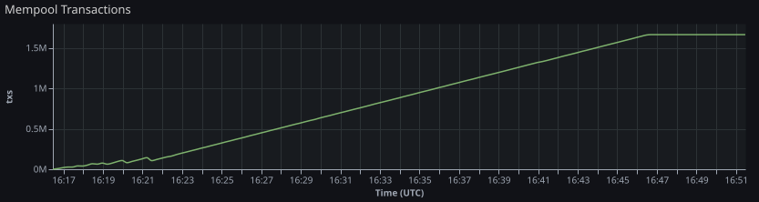

## Commit/Submit/Merge Progress

L1 commitment fee fields are derived as follows:

- `L1 Fees Δ` from `l1_commitment_fees_lovelace_total` counter delta over load phase.
- `Last L1 Fee` from `l1_commitment_fee_lovelace_last` instant value at load stop.
- `L1 Fee / Committed L2 Tx` = `L1 Fees Δ / Committed Tx Δ` when `Committed Tx Δ > 0`.

| Tier | Target TPS | Committed Blocks Δ | Submitted Blocks Δ | Merged Blocks Δ | Merge Failures Δ | Commit Failures Δ | L1 Fees Δ (lovelace) | Last L1 Fee (lovelace) | L1 Fee / Committed L2 Tx (lovelace) |
| ---- | ---------- | ------------------ | ------------------ | --------------- | ---------------- | ----------------- | -------------------- | ---------------------- | ----------------------------------- |
| 0    | 800        | 15                 | 11                 | 5               | 0                | 2                 | 2692836              | 224403                 | 3.42                                |

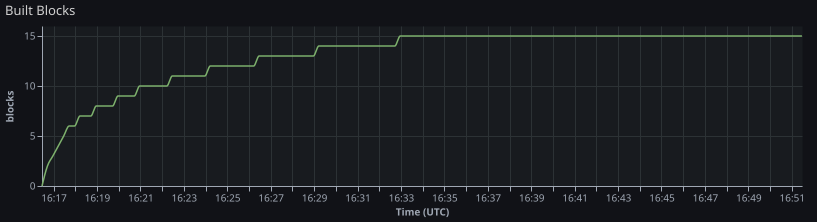

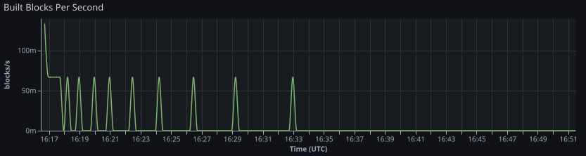

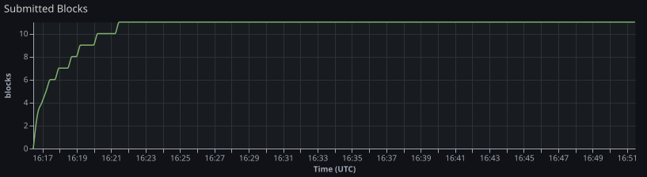

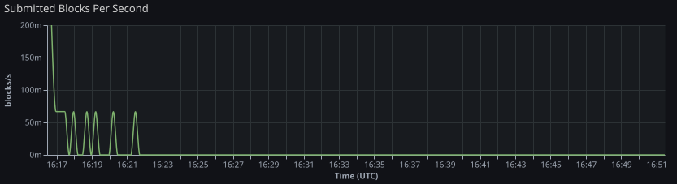

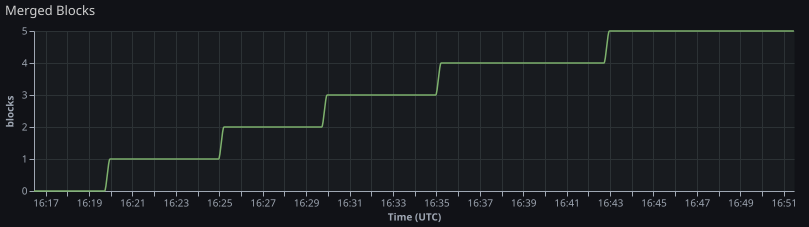

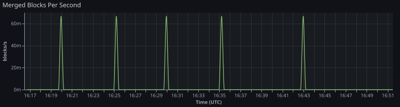

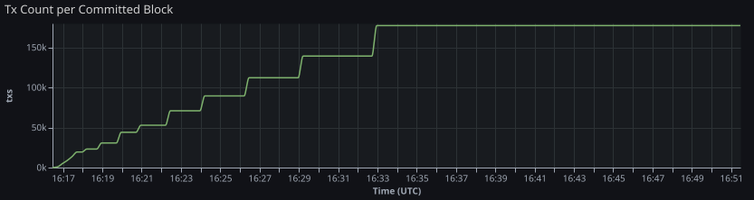

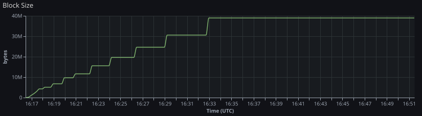

## Failure Signals

| Tier | Target TPS | Commit Failures Δ | Merge Failures Δ | Rejected Δ | Processing Failed Δ |
| ---- | ---------- | ----------------- | ---------------- | ---------- | ------------------- |
| 0    | 800        | 2                 | 0                | 0          | 0                   |

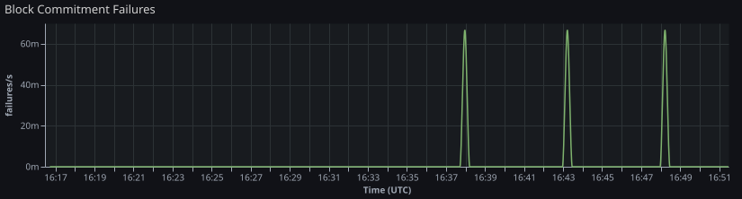

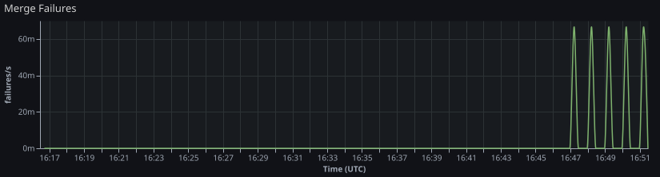

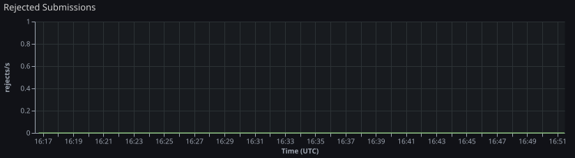

## Primary Bottleneck Hypothesis

**Identified bottleneck:** block commitment (mempool did not recover after load)

## Infrastructure

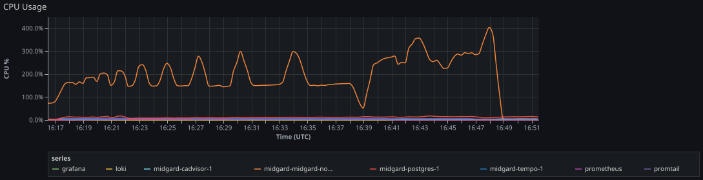

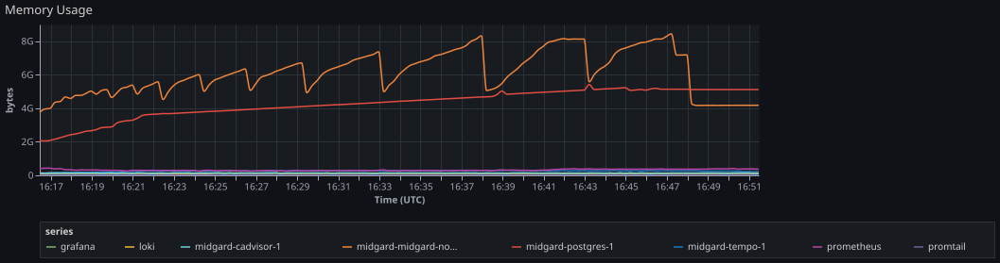

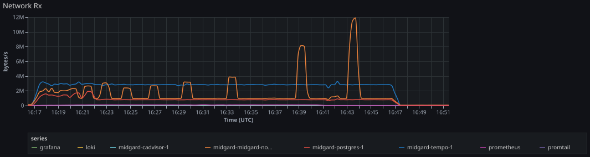

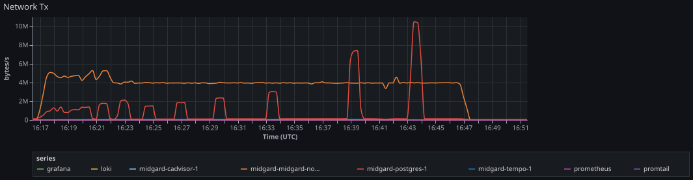

## Log Evidence (Loki)

Per-tier log capture from Loki over the tier window plus a short post-window tail.
Full log streams are in `loki-captures.json`.

| Tier | Target TPS | Tier Window                                 | Capture Range                               | Query                   | Streams | Entries | Truncated | Error |
| ---- | ---------- | ------------------------------------------- | ------------------------------------------- | ----------------------- | ------- | ------- | --------- | ----- |
| 0    | 800        | 2026-05-21T13:16:28Z → 2026-05-21T13:51:28Z | 2026-05-21T13:16:28Z → 2026-05-21T13:52:28Z | `{job="containerlogs"}` | 2       | 5000    | true      |       |

## Trace Evidence (Tempo)

Per-tier trace capture from Tempo over the full tier window (load phase + recovery).
Full trace summaries are in `tempo-captures.json`.

| Tier | Target TPS | Window                                      | Service      | Traces | Inspected | Truncated | Error |
| ---- | ---------- | ------------------------------------------- | ------------ | ------ | --------- | --------- | ----- |
| 0    | 800        | 2026-05-21T13:16:28Z → 2026-05-21T13:51:28Z | midgard-node | 0      | n/a       | false     |       |

## Artifact Index

- `load-events.jsonl`
- `loki-captures.json`
- `prometheus-samples.json`
- `report.md`
- `run-manifest.json`
- `scenario.json`
- `stdout.log`
- `summary.json`
- `tempo-captures.json`
- `tier-summaries.jsonl`

## Limitations

- This run measures current behavior without remediation.
  No performance tuning, protocol changes, or infrastructure adjustments were applied.
- Results reflect a single run under the configured synthetic load profile.
  They may not reproduce identically under different hardware, network, or node state.
- This report does not claim or imply production scalability.
  Observed TPS figures are specific to the test configuration and should not be extrapolated.
- Enqueued TPS, mempool accepted TPS, and committed TPS are distinct pipeline boundaries.
  Conflating them overstates actual throughput.
- The legacy alias `tx_submissions_accepted_total` is intentionally excluded
  from this report to keep enqueue and durable-acceptance boundaries explicit.
- Bottleneck attribution is derived from counter deltas over the tier window.
  Scrape jitter, slow counters, or incomplete Prometheus data may reduce accuracy.
- Accepted-to-committed latency is a cohort estimate from counter alignment,
  not per-transaction tracing. It is bounded by Prometheus scrape cadence and window coverage.
