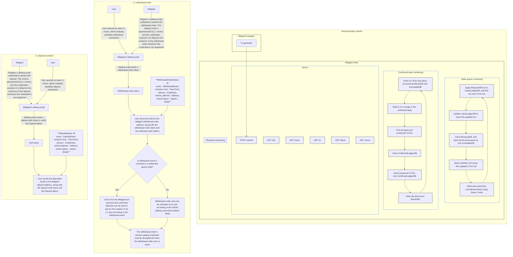

```mermaid

flowchart TB

subgraph GeneralProjectScheme["General project sheme"]
    direction TB

    subgraph MidgardManager["Midgard manager"]
        style MidgardManager stroke:#000000

        Tx-generator["Tx-generator"]
            style Tx-generator stroke:#2962FF
    end

    subgraph MidgardNode["Midgard node"]
        style MidgardNode stroke:#000000
        SQM
        CSM
        Server
        MempoolMonitoring
    end

    subgraph SQM["State queue monitoring"]
        style SQM stroke:#2962FF
        direction TB
        SQM1["Apply MempoolDB txs to LatestLedgerDB, and find the new UTxO set"]
            style SQM1 stroke:#000000
        SQM2["Update LatestLedgerDB to store this updated set"]
            style SQM2 stroke:#000000
        SQM3["Clear MempoolDB, and inject all the processed txs into ImmutableDB"]
            style SQM3 stroke:#000000
        SQM4["Build a Merkle root using this updated UTxO set"]
            style SQM4 stroke:#000000
        SQM5["Build and submit the commitment block using these 2 roots"]
            style SQM5 stroke:#000000

        SQM1 --> SQM2
        SQM2 --> SQM3
        SQM3 --> SQM4
        SQM4 --> SQM5
        SQM5 --> SQM1

    end

    subgraph CSM["Confirmed state monitoring"]
        direction TB
        style CSM stroke:#2962FF
        CSM1["Fetch txs of the first block by querying BlocksDB and ImmutableDB"]
            style CSM1 stroke:#000000
        CSM2["Build a tx to merge to the confirmed state"]
            style CSM2 stroke:#000000
        CSM3["Find all spent and produced UTxOs"]
            style CSM3 stroke:#000000
        CSM4["Clear ConfirmedLedgerDB"]
            style CSM4 stroke:#000000
        CSM5["Insert produced UTxOs into ConfirmedLedgerDB"]
            style CSM5 stroke:#000000
        CSM6["Clear the block from BlocksDB"]
             style CSM6 stroke:#000000

        CSM1 --> CSM2
        CSM2 --> CSM3
        CSM3 --> CSM4
        CSM4 --> CSM5
        CSM5 --> CSM6
        CSM6 --> CSM1
    end

    subgraph Server["Server"]
        style Server stroke:#2962FF
        ServerE1["GET /init"]
            style ServerE1 stroke:#000000
        ServerE2["GET /reset"]
            style ServerE2 stroke:#000000
        ServerE3["GET /tx"]
            style ServerE3 stroke:#000000
        ServerE4["GET /block"]
            style ServerE4 stroke:#000000
        ServerE5["GET /utxos"]
            style ServerE5 stroke:#000000
        ServerE6["POST /submit"]
            style ServerE6 stroke:#000000
    end

    subgraph MempoolMonitoring["Mempool monitoring"]
        style MempoolMonitoring stroke:#2962FF
    end

    Tx-generator --> ServerE6

end

 subgraph L1WithdrawalOrder["L1 withdrawal order"]
    direction TB
    L1WOMidgard["Midgard"]
    L1WOUser["User"]
    L1WOStakingScript["Midgard's staking script"]
    L1WOToken["Withdrawal order token"]
    L1WODatumScheme["**WithdrawalOrderDatum ≔<br>event : WithdrawalEvent,<br>inclusion time : PosixTime,<br>witness : SciptHash,<br>refund_address : Address,<br>refund datum : Option ( Data)**"]
    L1WOTokenSend[User Send min-ADA to the Midgard withdrawal order address, along with the withdrawal order token and the witdrawal order datum]
    L1WOOutcomeBranching@{ shape: diam, label: "Is withdrawal event is included in a settlement queue node?"}
    L1WOOutcomeYes[Utxos from the Midgard are reserved and confirmed deposits can be used to pay for the creation of an L1 utxo according to the withdrawal event]
    L1WOOutcomeNo[Withdrawal order utxo can be refunded to its user according to the refund address and refund datum fields]
    L1WODeregistration[The withdrawal order’s witness staking credential must be deregistered when the withdrawal order utxo is spent]

    L1WOUser -- User spends an input L1 nonce, which uniquely identifies withdrawal transaction --> L1WOStakingScript
    L1WOMidgard -- "Register a staking script credential to witness the withdrawal order. The staking script is parametrized by L1 nonce, and the credential's purpose is to disprove the existence of the withdrawal order whenever the credential is not registered" --> L1WOStakingScript
    L1WOStakingScript -- Staking script mints a withdrawal order token --> L1WOToken
    L1WOToken & L1WODatumScheme --> L1WOTokenSend
    L1WOTokenSend --> L1WOOutcomeBranching
    L1WOOutcomeBranching -- Yes --> L1WOOutcomeYes
    L1WOOutcomeBranching -- No --> L1WOOutcomeNo
    L1WOOutcomeYes & L1WOOutcomeNo --> L1WODeregistration

  end

 subgraph L1DepositScenario["L1 deposit scenario"]
    direction TB
    L1DSMidgard["Midgard"]
    L1DSUser["User"]
    L1DSStakingScript@{ label: "Midgard's staking script" }
    L1DSToken["Auth token"]
    L1DSDatumScheme["**DepositDatum ≔<br>event : DepositEvent,<br>inclusion time : PosixTime,<br>witness : ScriptHash,<br>refund address : Address,<br>refund datum : Option (Data)**"]
    L1DSEnd["User sends the deposited funds to the Midgard deposit address, along with the deposit auth token and the Deposit datum."]

    L1DSMidgard -- "Register a staking script credential to witness the deposit. The script is parametrized by L1 nonce, and the credential's purpose is to disprove the existence of the deposit whenever the credential is not registered" --> L1DSStakingScript
    L1DSUser -- User spends an input L1 nonce, which uniquely identifies deposit transaction --> L1DSStakingScript
    L1DSStakingScript -- Staking script mints a deposit auth token to verify the Deposit datum --> L1DSToken
    L1DSToken ---> L1DSEnd
    L1DSDatumScheme ---> L1DSEnd
  end

```