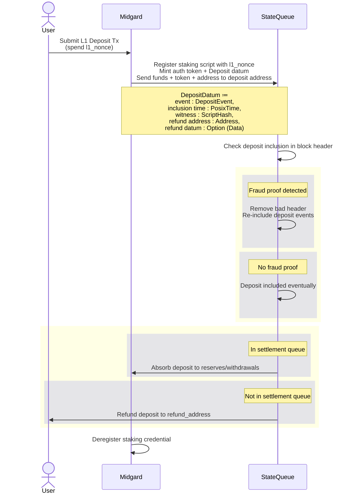

```mermaid

sequenceDiagram

  Actor User
  participant Midgard
  participant StateQueue
  User ->> Midgard: Submit L1 Deposit Tx<br>(spend l1_nonce)
  Midgard ->> StateQueue: Register staking script with l1_nonce<br>Mint auth token + Deposit datum<br>Send funds + token + address to deposit address
  Note over Midgard,StateQueue: DepositDatum ≔<br>event : DepositEvent,<br>inclusion time : PosixTime,<br>witness : ScriptHash,<br>refund address : Address,<br>refund datum : Option (Data)
  StateQueue ->> StateQueue: Check deposit inclusion in block header

  rect rgba(255, 255, 0, .1)
  rect rgba(0, 0, 255, .1)
  Note over StateQueue: Fraud proof detected
  StateQueue ->> StateQueue: Remove bad header<br>Re-include deposit events
  end

  rect rgba(0, 0, 255, .1)
  Note over StateQueue: No fraud proof
  StateQueue ->> StateQueue: Deposit included eventually
  end
  end

  rect rgba(255, 255, 0, .1)
  rect rgba(0, 0, 255, .1)
  Note over StateQueue: In settlement queue
  StateQueue ->> Midgard: Absorb deposit to reserves/withdrawals
  end

  rect rgba(0, 0, 255, .1)
  Note over StateQueue: Not in settlement queue
  StateQueue ->> User: Refund deposit to refund_address
  end
  end

  Midgard ->> Midgard: Deregister staking credential

```