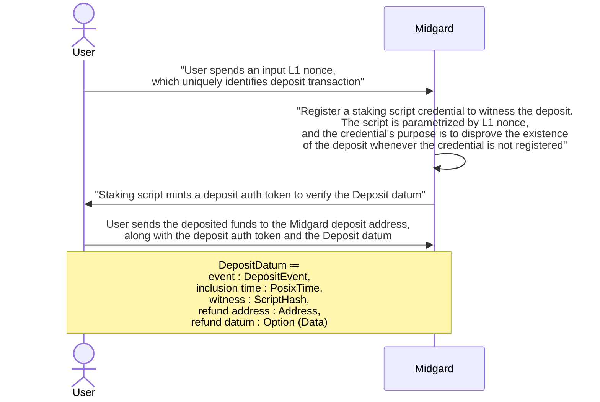

```mermaid

sequenceDiagram

  Actor User
  participant Midgard
  User ->> Midgard: "User spends an input L1 nonce,<br>which uniquely identifies deposit transaction"
  Midgard ->> Midgard: "Register a staking script credential to witness the deposit.<br>The script is parametrized by L1 nonce,<br>and the credential's purpose is to disprove the existence<br>of the deposit whenever the credential is not registered"
  Midgard ->> User: "Staking script mints a deposit auth token to verify the Deposit datum"
  User ->> Midgard:User sends the deposited funds to the Midgard deposit address,<br>along with the deposit auth token and the Deposit datum
  Note over User,Midgard: DepositDatum ≔<br>event : DepositEvent,<br>inclusion time : PosixTime,<br>witness : ScriptHash,<br>refund address : Address,<br>refund datum : Option (Data)
```