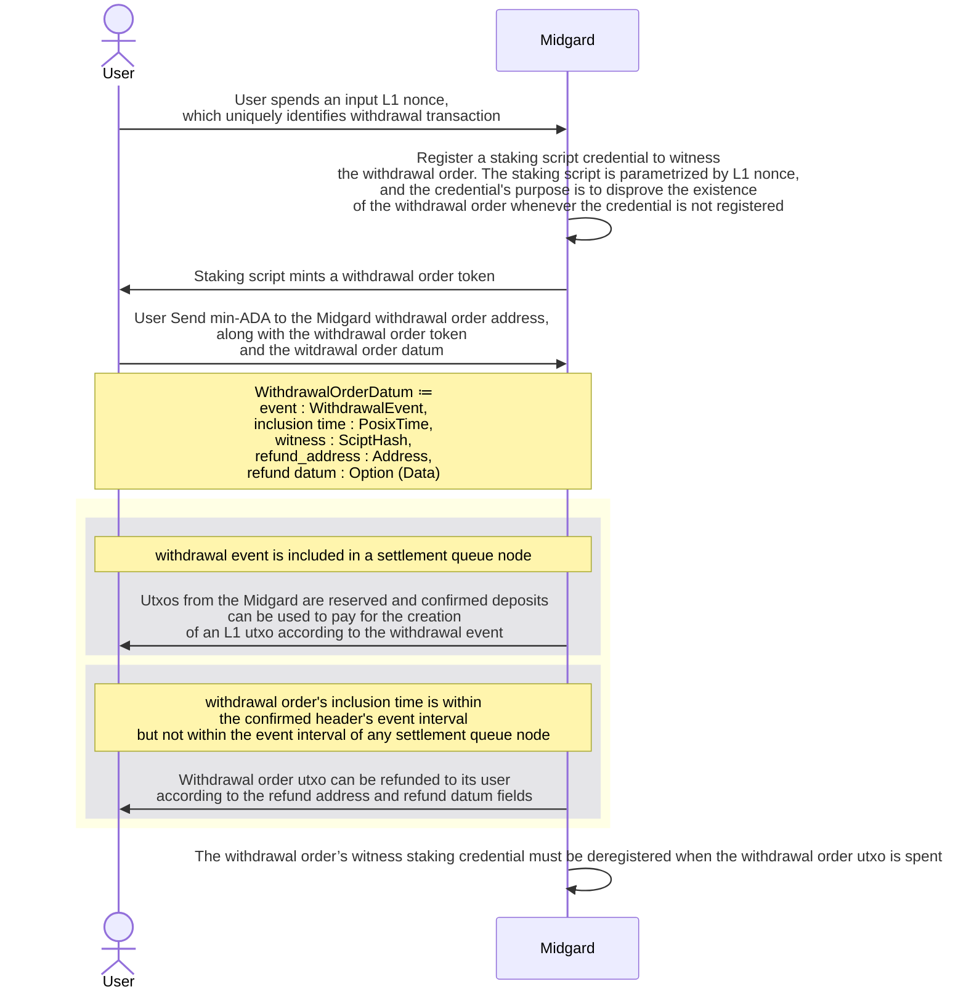

```mermaid

sequenceDiagram

  Actor User
  participant Midgard
  User ->> Midgard: User spends an input L1 nonce,<br>which uniquely identifies withdrawal transaction
  Midgard ->> Midgard: Register a staking script credential to witness<br>the withdrawal order. The staking script is parametrized by L1 nonce,<br>and the credential's purpose is to disprove the existence<br>of the withdrawal order whenever the credential is not registered
  Midgard ->> User: Staking script mints a withdrawal order token
  User ->> Midgard:User Send min-ADA to the Midgard withdrawal order address,<br>along with the withdrawal order token<br>and the witdrawal order datum
  Note over User,Midgard: WithdrawalOrderDatum ≔<br>event : WithdrawalEvent,<br>inclusion time : PosixTime,<br>witness : SciptHash,<br>refund_address : Address,<br>refund datum : Option (Data)
  rect rgba(255, 255, 0, .1)
  rect rgba(0, 0, 255, .1)
  Note over Midgard,User: withdrawal event is included in a settlement queue node
  Midgard->>User: Utxos from the Midgard are reserved and confirmed deposits<br>can be used to pay for the creation<br>of an L1 utxo according to the withdrawal event
  end
  rect rgba(0, 0, 255, .1)
   Note over Midgard,User: withdrawal order's inclusion time is within<br>the confirmed header's event interval<br>but not within the event interval of any settlement queue node
  Midgard->>User: Withdrawal order utxo can be refunded to its user<br>according to the refund address and refund datum fields
  end
  end
  
  Midgard ->> Midgard: The withdrawal order’s witness staking credential must be deregistered when the withdrawal order utxo is spent
```