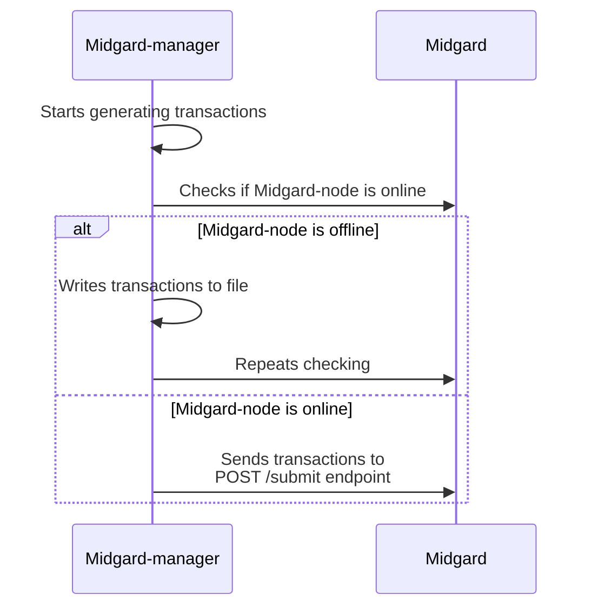

```mermaid

sequenceDiagram

  participant Midgard-manager
  participant Midgard
  Midgard-manager ->> Midgard-manager: Starts generating transactions
  Midgard-manager ->> Midgard: Checks if Midgard-node is online
  alt Midgard-node is offline
    Midgard-manager ->> Midgard-manager: Writes transactions to file
    Midgard-manager ->> Midgard: Repeats checking
  else Midgard-node is online
    Midgard-manager ->> Midgard: Sends transactions to<br>POST /submit endpoint
  end

```