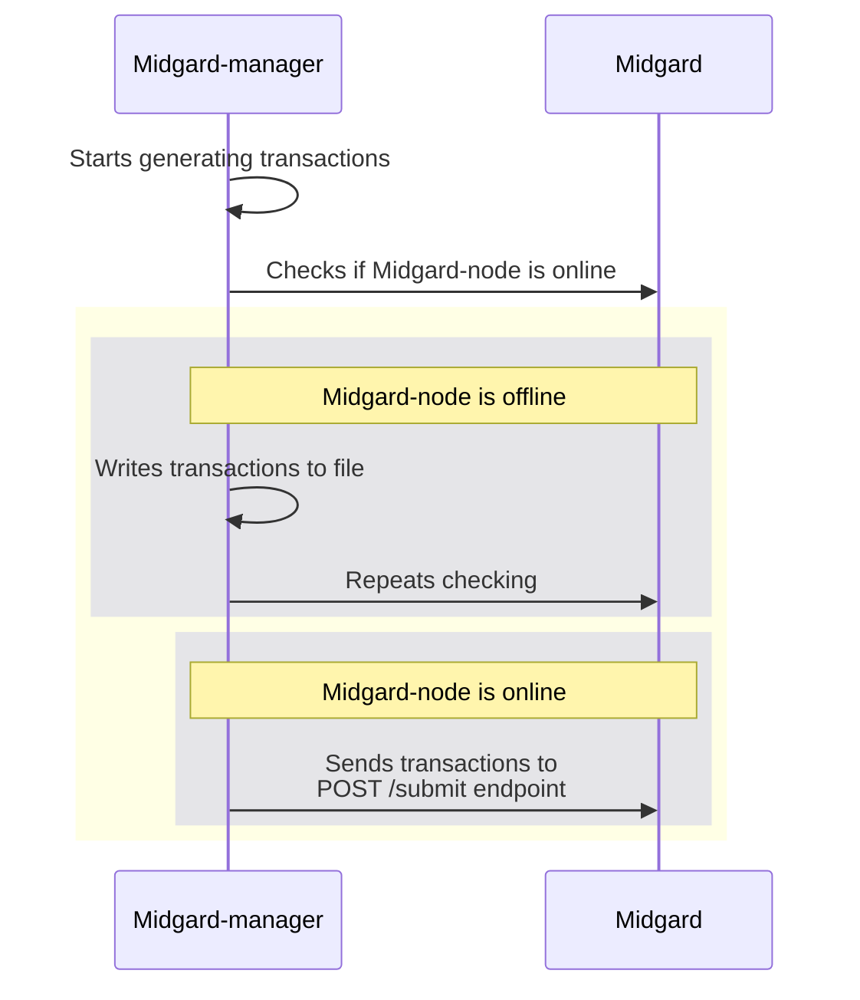

```mermaid

sequenceDiagram

  participant Midgard-manager
  participant Midgard
  Midgard-manager ->> Midgard-manager: Starts generating transactions
  Midgard-manager ->> Midgard: Checks if Midgard-node is online
  rect rgba(255, 255, 0, .1)
  rect rgba(0, 0, 255, .1)
  Note over Midgard-manager, Midgard: Midgard-node is offline
  Midgard-manager ->> Midgard-manager: Writes transactions to file
  Midgard-manager ->> Midgard: Repeats checking
  end

  rect rgba(0, 0, 255, .1)
  Note over Midgard-manager, Midgard: Midgard-node is online
  Midgard-manager ->> Midgard: Sends transactions to<br>POST /submit endpoint
  end
  end

```