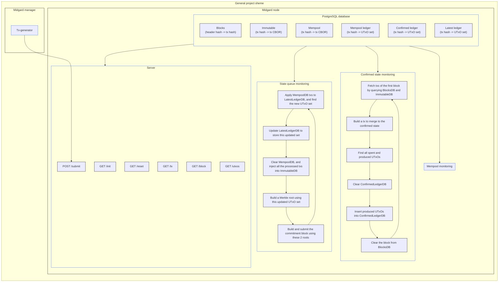

```mermaid

flowchart TB

subgraph GeneralProjectScheme["General project sheme"]
    direction TB

    subgraph MidgardManager["Midgard manager"]
        style MidgardManager stroke:#000000

        Tx-generator["Tx-generator"]
            style Tx-generator stroke:#2962FF
    end

    subgraph MidgardNode["Midgard node"]
        direction LR
        style MidgardNode stroke:#000000
        Database
        SQM
        CSM
        Server
        MempoolMonitoring

        Database --> SQM & CSM & Server & MempoolMonitoring
    end

    subgraph SQM["State queue monitoring"]
        style SQM stroke:#2962FF
        direction TB
        SQM1["Apply MempoolDB txs to LatestLedgerDB, and find the new UTxO set"]
            style SQM1 stroke:#000000
        SQM2["Update LatestLedgerDB to store this updated set"]
            style SQM2 stroke:#000000
        SQM3["Clear MempoolDB, and inject all the processed txs into ImmutableDB"]
            style SQM3 stroke:#000000
        SQM4["Build a Merkle root using this updated UTxO set"]
            style SQM4 stroke:#000000
        SQM5["Build and submit the commitment block using these 2 roots"]
            style SQM5 stroke:#000000

        SQM1 --> SQM2
        SQM2 --> SQM3
        SQM3 --> SQM4
        SQM4 --> SQM5
        SQM5 --> SQM1

    end

    subgraph CSM["Confirmed state monitoring"]
        direction TB
        style CSM stroke:#2962FF
        CSM1["Fetch txs of the first block by querying BlocksDB and ImmutableDB"]
            style CSM1 stroke:#000000
        CSM2["Build a tx to merge to the confirmed state"]
            style CSM2 stroke:#000000
        CSM3["Find all spent and produced UTxOs"]
            style CSM3 stroke:#000000
        CSM4["Clear ConfirmedLedgerDB"]
            style CSM4 stroke:#000000
        CSM5["Insert produced UTxOs into ConfirmedLedgerDB"]
            style CSM5 stroke:#000000
        CSM6["Clear the block from BlocksDB"]
             style CSM6 stroke:#000000

        CSM1 --> CSM2
        CSM2 --> CSM3
        CSM3 --> CSM4
        CSM4 --> CSM5
        CSM5 --> CSM6
        CSM6 --> CSM1
    end

    subgraph Server["Server"]
        style Server stroke:#2962FF
        ServerE1["GET /init"]
            style ServerE1 stroke:#000000
        ServerE2["GET /reset"]
            style ServerE2 stroke:#000000
        ServerE3["GET /tx"]
            style ServerE3 stroke:#000000
        ServerE4["GET /block"]
            style ServerE4 stroke:#000000
        ServerE5["GET /utxos"]
            style ServerE5 stroke:#000000
        ServerE6["POST /submit"]
            style ServerE6 stroke:#000000
    end

    subgraph MempoolMonitoring["Mempool monitoring"]
        style MempoolMonitoring stroke:#2962FF
    end

    subgraph Database[PostgreSQL database]
    direction TB
        style Database stroke:#2962FF
        DbBlocks["Blocks<br>(header hash -> tx hash)"]
            style DbBlocks stroke:#000000
        DbImmutable["Immutable<br>(tx hash -> tx CBOR)"]
            style DbImmutable stroke:#000000
        DbMempool["Mempool<br>(tx hash -> tx CBOR)"]
            style DbMempool stroke:#000000
        DbMempoolLedger["Mempool ledger<br>(tx hash -> UTxO set)"]
            style DbMempoolLedger stroke:#000000
        DbConfirmedLedger["Confirmed ledger<br>(tx hash -> UTxO set)"]
            style DbConfirmedLedger stroke:#000000
        DbLatestLedger["Latest ledger<br>(tx hash -> UTxO set)"]
            style DbLatestLedger stroke:#000000
    end

    Tx-generator --> ServerE6

end

```
