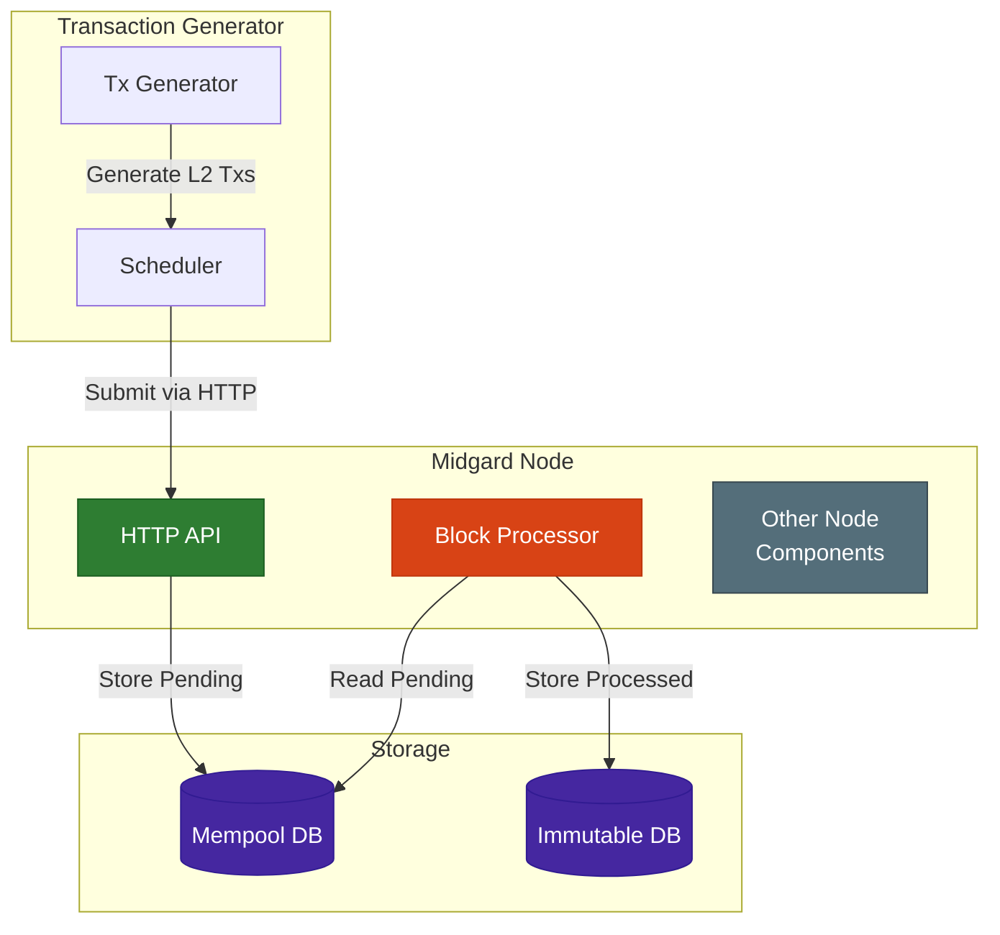

import { Table, Callout } from "nextra/components";

# [000 - Example Decision]

<Callout type="info">
  Keep the title clear and specific. For example: "Using SQLite as Database" or
  "Adopting Convention X".
</Callout>

## Motivation

[Explain the reasoning for the decision]

- What triggered this decision?
- Why does it matter now?

## Decision

[Describe what is being proposed]

### Example Diagram

<Callout type="info">
  For more examples on mermaid diagrams, see the [mermaid
  docs](https://mermaid.js.org/syntax/flowchart.html).
</Callout>

## (Optional) Alternatives

[Describe the alternatives considered]

<Table>
  <thead>
    <Table.Tr>
      <Table.Th>Alternatives</Table.Th>
      <Table.Th>Pros</Table.Th>
      <Table.Th>Cons</Table.Th>
    </Table.Tr>
  </thead>
  <tbody>
    <Table.Tr>
      <Table.Td>Option A</Table.Td>
      <Table.Td>- Easy to implement</Table.Td>
      <Table.Td>- Limited scalability</Table.Td>
    </Table.Tr>
    <Table.Tr>
      <Table.Td>Option B</Table.Td>
      <Table.Td>- Better performance</Table.Td>
      <Table.Td>- More costs</Table.Td>
    </Table.Tr>
  </tbody>
</Table>

## Impact

[Describe the impact of the decision]

## Notes

- [Key discussion]
- [Open questions]
- [Related decisions]
